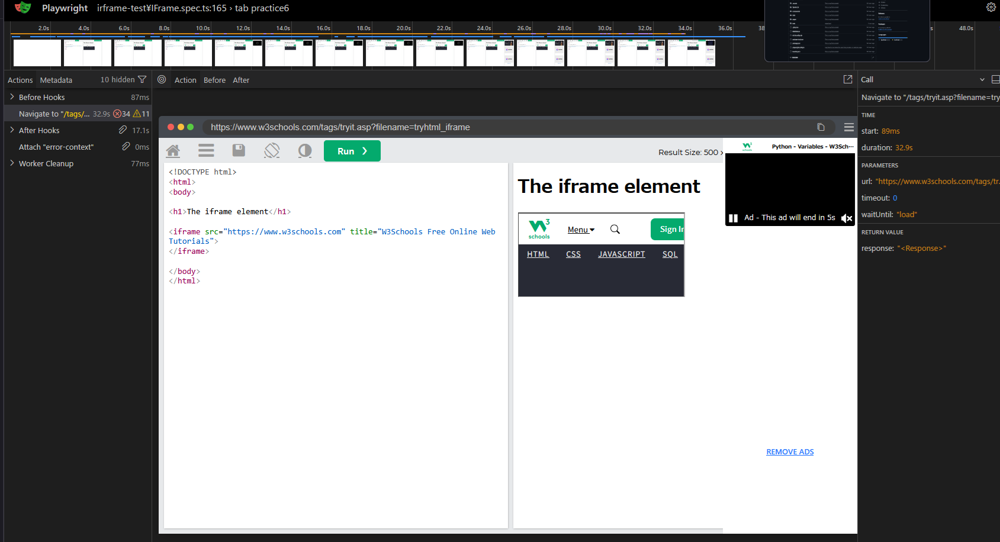

[English README](./README.en.md)

my-playwright-project
Playwright × TypeScript による、実務レベルの E2E テスト自動化プロジェクトです。
単なる操作の自動化に留まらず、「運用コストの低減」と「テストの信頼性」にフォーカスし、実際の開発現場で即導入・運用できるレベルの構成を実現しています。
🎯 プロジェクトの狙い
Web アプリケーションの品質保証において、自動テストの最大の敵は「壊れやすさ（Flaky Test）」と「実行時間の肥大化」です。本プロジェクトでは、Microsoft 製の Playwright をベースに、これらの課題を解決するための設計パターン（POM、リトライ戦略、並列実行設計）を組み込んでいます。
📁 ディレクトリ構成
text

my-playwright-project/
├── tests/                # POM を用いた UI テスト（機能別・シナリオ別）
├── test/                 # 高度なテスト（API・ダウンロード・iframe 等）
├── pages/                # Page Object Model（各ページの要素・操作ロジック）
├── components/           # 共通コンポーネント（サーチボタン、タブコードブロックなど）の操作集
├── data/                 # テストデータ（環境変数や期待値の外部化）
├── playwright.config.ts  # 実行戦略（リトライ・並列数・タイムアウト）の設定
└── .github/workflows/    # CI パイプライン（GitHub Actions）

コードは注意してご使用ください。

🛠 実装のこだわり（実務アピールポイント）
1. 徹底した Page Object Model (POM) 設計
UI の変更に対してテストコードの修正箇所を最小限に抑えるため、要素取得と操作ロジックを分離。保守性の高いコードベースを維持しています。
2. テストの信頼性担保（Flaky Test 対策）
ネットワークの揺らぎや一時的なレンダリング遅延による「偽陰性」を防ぐため、CI 環境における 自動リトライ（最大2回） を導入。安定したパス率を確保し、開発者の調査コストを削減します。
3. 実行速度の最適化とスケーラビリティ
Worker 数を調整することで、ローカル・CI 両環境での 並列実行（Parallel Execution） を最適化しています。

    スケーラビリティ: 現在は GitHub 無料枠のリソースに合わせて最適化していますが、大規模プロジェクトでは Playwright の shard 機能を活用し、複数マシンへの分散実行によって実行時間を劇的に短縮する設計を想定しています。

4. API と UI を組み合わせたハイブリッドテスト
UI 操作だけでなく API テストも実装。テスト前後のデータセット作成・削除を API で行うことで、E2E テスト全体の高速化と安定化を図っています。
5. デバッグ性の向上
失敗時のスクリーンショット保存、動画記録、および Trace Viewer の活用により、CI 上で発生したエラーの原因特定を迅速に行えるよう構成しています。
🧪 実装しているテストケース

    UI テスト: ページ遷移、バリデーション、複雑なフォーム入力、動的な要素表示。
    API テスト: レスポンス検証、ステータスコード、スキーマチェック。
    高度な操作: iframe 内の要素操作、ファイルダウンロードの整合性チェック。

🧩 使用技術

    Framework: Playwright (TypeScript)
    CI/CD: GitHub Actions
    Language: TypeScript (型安全なテスト記述)
    Reporting: Playwright HTML Report / Trace Viewer

▶️ セットアップ & 実行
bash

# インストール
npm install
npx playwright install

# テスト実行（全ケース）
npx playwright test

# レポート確認
npx playwright show-report

コードは注意してご使用ください。

💡 補足：本プロジェクトの技術選定理由
本プロジェクトは Playwright 公式ドキュメント を題材に、実際の Web サイト構造を分析・攻略する形で設計しています。
「なぜこの設計にしたのか」「Flaky 対策として何が必要か」といった、自動化エンジニアに求められる戦略的思想をコードとして表現しています。
