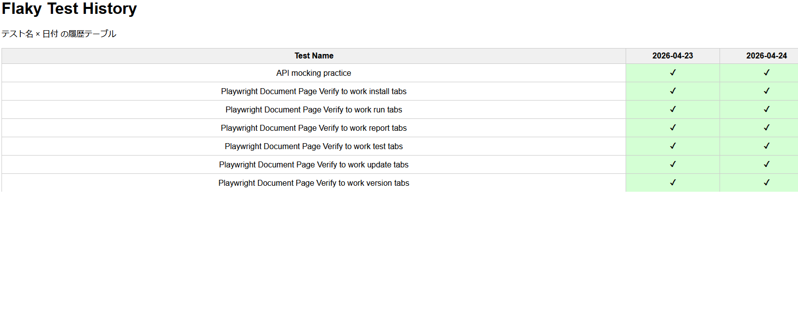

[English README](README.en.md)

このプロジェクトは、Playwrightを用いたUI × APIのE2E自動テスト基盤です。
POM設計・APIテスト・CI/CD統合・並列実行など、実務レベルの構成を10日で構築しました。
UI/REST APIの統合テストと安定化設計を重視しています。

[自動テストの動作動画]

🎯 プロジェクトの目的

    Playwrightを用いたUIテスト自動化の実践

    REST APIを対象としたAPIテストの導入

    UIとAPIを組み合わせた統合テストの構築

    Page Object Model（POM）によるテスト構造化

    Flaktを抑えるための安定化設計

    並列実行・shard による高速化

    GitHub Actionsを用いたCI/CD パイプライン構築

    短期間で実務レベルの自動化基盤を構築できるスキルの証明

🚀 特徴（Features）
■ UI × API の統合テスト

    Playwrightのrequest API を使用

    GET / POST / PUT / DELETE を網羅

    ステータスコード・レスポンスボディの検証

    UIとAPI を組み合わせたシナリオテストに対応

■ Page Object Model（POM）による拡張性

    ページ単位で責務を分離

    テストコードの可読性・保守性を向上

    実務で一般的な構成を採用

■ Flakyを抑える安定化設計

    適切なロケータ選定

    iframe（frameLocator）対応

    遅延読み込みへの対策

    明示的な待機の最小化

    CI環境を考慮したリトライ戦略

    個人環境の CIランナーでは一部 Flaky が発生するが、実務では高性能ランナーを選択することで解消可能

       
■ 並列実行・shard による高速化

    Playwrightの並列実行機能を活用

    CI上でも高速に動作するよう最適化

■ GitHub Actions によるCI/CD統合

    push/PR 時に自動テスト実行

    UI/API テストを並列で実行

    動画・スクリーンショットの保存

    実務のワークフローを再現

    品質メトリクスに使用するためのFlakyなテストの検出

🕒 10 日以内で構築した内容

以下の工程を短期間で完了し、キャッチアップ能力と基盤構築力を示しています。

    Playwright セットアップ

    UIテスト実装

    APIテスト実装

    POM設計

    Flaky対策

    並列実行設定

    GitHub Actions によるCI/CDパイプライン構築

📁 ディレクトリ構成（抜粋）
コード

my-playwright-project/
├── playwright.config.ts
├── package.json
├── tests/
│   ├── ui/
│   ├── api/
├── pages/
│   ├── LoginPage.ts
│   ├── DashboardPage.ts
└── .github/
    └── workflows/
        └── playwright.yml

🧪 実行方法

    依存関係インストール
    npm install

    UIテスト
    npx playwright test tests/ui

    APIテスト
    npx playwright test tests/api

    UIモード
    npx playwright test --ui
  
Flakyテストの統計
https://yossie0128-stack.github.io/my-playwright-project/history-report.html
[参考画像] 

📌 今後の拡張予定

ディレクトリ構造の整理（pages / componentsをsrc 配下へ移動）

POMのセレクタの分離を進め、より運用を楽にする。

fixturesの導入（過度な抽象化を避け、POMのDIは採用しない方針）

品質メトリクス用のテスト失敗などの情報をSlackなどに自動通知する

~~テストランナーをLinuxへ変更（Playwright 推奨・無料枠でも高性能）~~ -> 変更を行ったら50%ほど速くなった上、iframeの処理が安定するようになった。

APIモックサーバーとの統合

テストデータ管理の改善

UI × API の複雑な統合シナリオ追加

負荷テストとの連携

